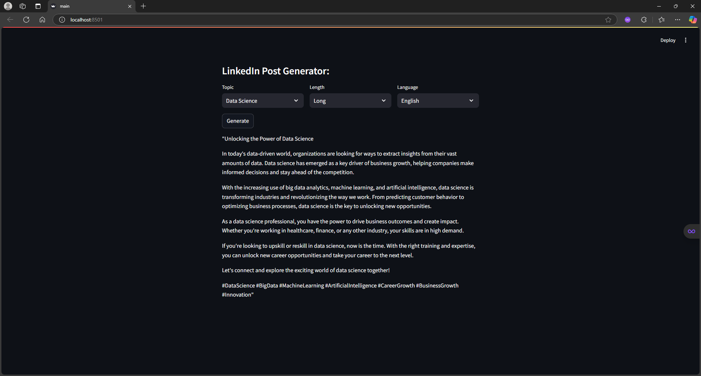

# LinkedIn-post-generator
This tool will analyze your previous posts of a LinkedIn and help you create the new posts based on your writing style in your old posts  


Let's say Mohan is a LinkedIn user and he needs help in writing his future posts or thoughts. He can feed his past LinkedIn posts to this tool and it will extract key topics. Then he can select the topic, length, language etc. and use Generate button to create a new post that will match his writing style. 

## Technical Architecture


1. Stage 1: Collect LinkedIn posts and extract Topic, Language, Length etc. from it.
1. Stage 2: Now use topic, language and length to generate a new post. Some of the past posts related to that specific topic, language and length will be used for few shot learning to guide the LLM about the writing style etc.

## Set-up
1. To get started we first need to get an API_KEY from here: https://console.groq.com/keys. Inside `.env` update the value of `GROQ_API_KEY` with the API_KEY you created. 
2. To get started, first install the dependencies using:
    ```commandline
     pip install -r requirements.txt
    ```
3. Run the streamlit app:
   ```commandline
   streamlit run main.py
   ```
Here’s a note you can attach to your README file:  

---  

## **Note:**  
This project was carried out with reference to projects published by Codebasics. While the core structure and methodology align with the original project, I have made modifications to personalize it based on my previous LinkedIn post. The changes include custom adaptations to better fit my use case and objectives.
